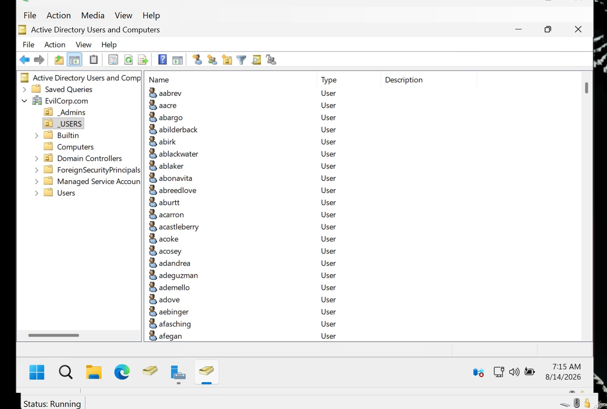
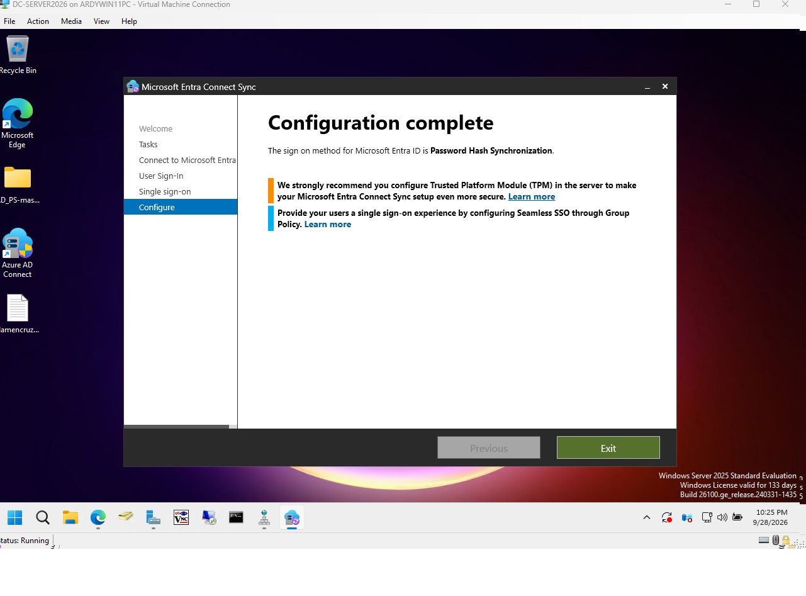
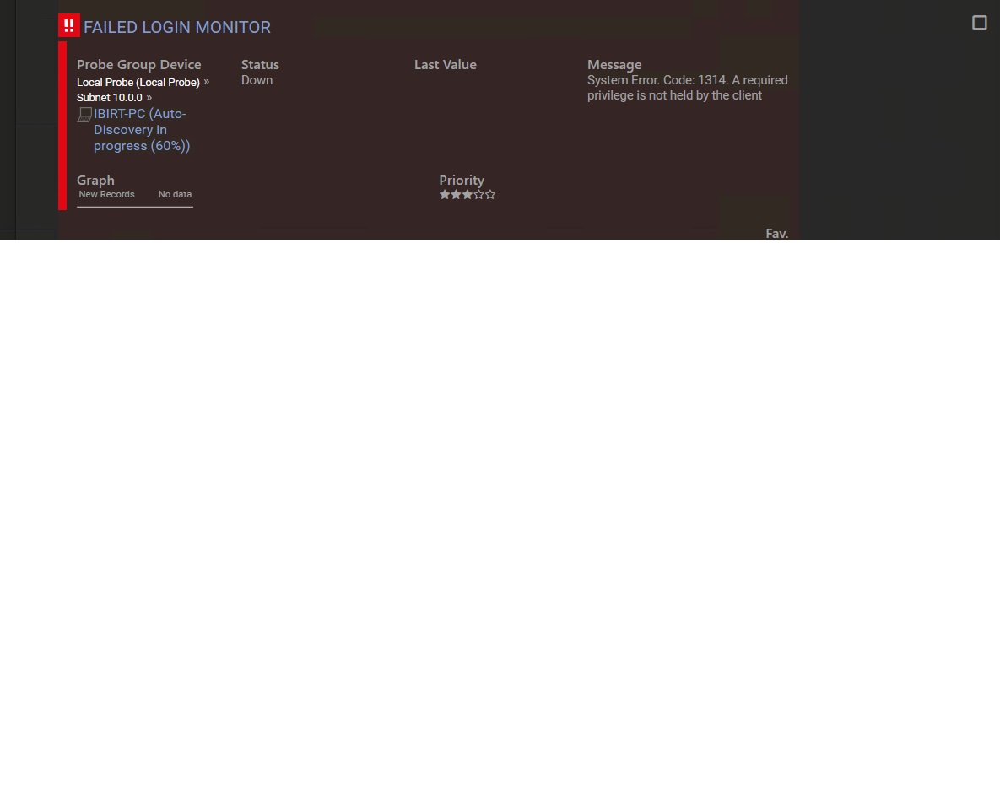
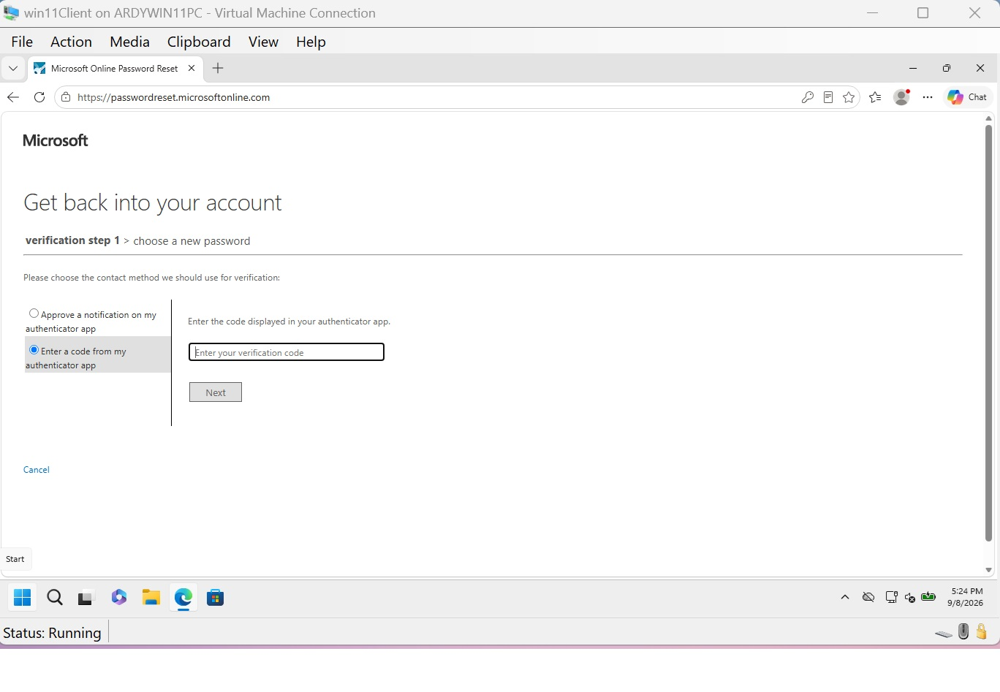
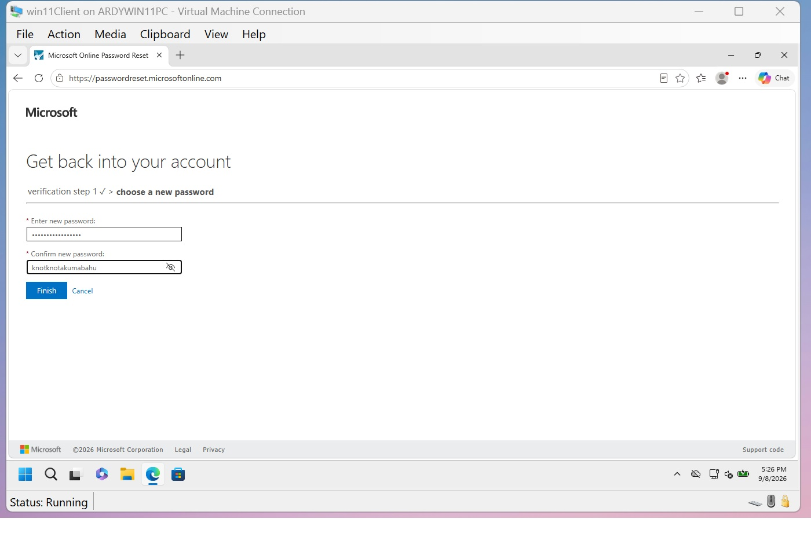
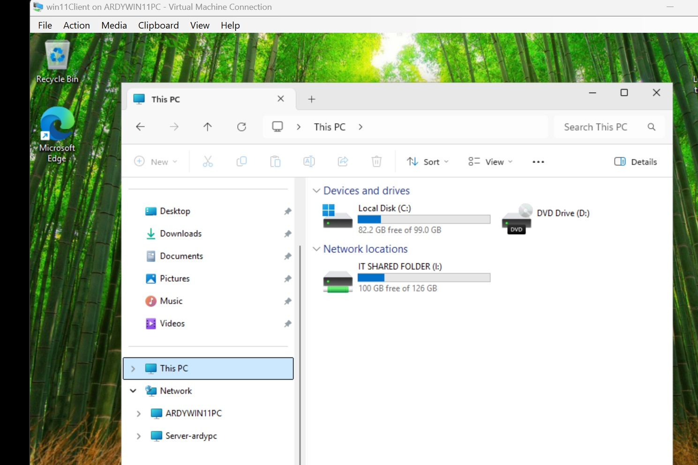
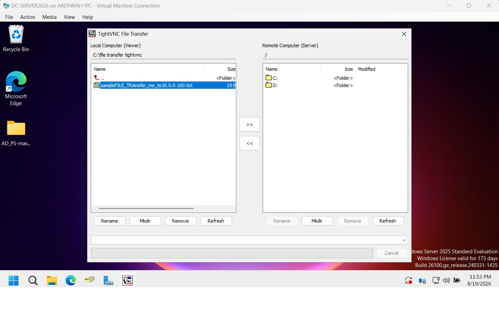
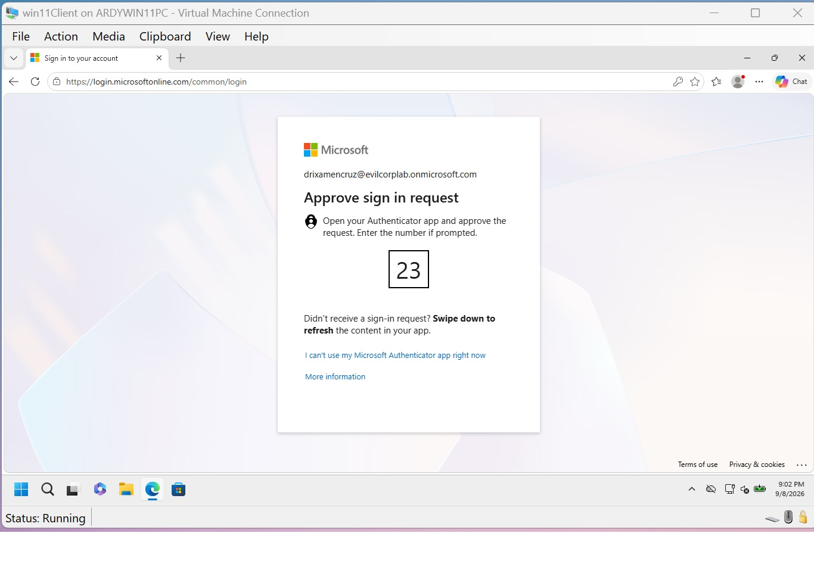
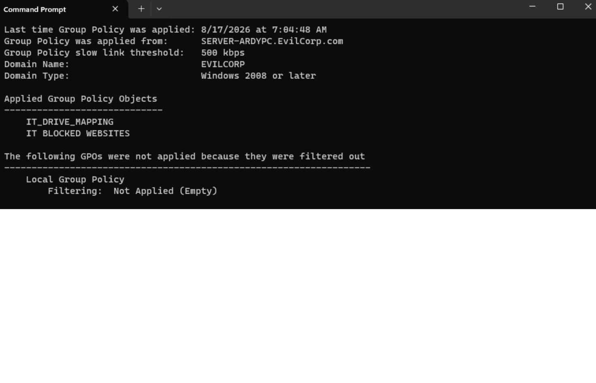

# Hybrid Cloud Identity & Enterprise Active Directory Deployment Lab

## Executive Summary
Engineered and deployed an end-to-end hybrid identity and monitoring infrastructure using **Windows Server 2025 Standard**, **Active Directory Domain Services (AD DS)**, **Microsoft Entra Connect**, **Microsoft Entra ID (Azure AD)**, and **PRTG Network Monitor**. Simulated enterprise IT/SecOps workflows including automated user provisioning, Seamless Single Sign-On (SSO) integration, dual-NIC Hyper-V virtual switch routing via RRAS/NAT, `/24` subnetting, DNS/DHCP administration, network drive GPOs, SSPR with MFA, remote management via TightVNC, and SIEM-style intrusion/failed logon event monitoring via PRTG.

---

## Technical Environment Architecture
- **Hypervisor:** Microsoft Hyper-V Manager
- **Domain Controller / Primary DNS Server:** Windows Server 2025 Standard (`DC-SERVER2025` | Static IP: `10.0.0.1`)
- **Client Endpoint:** Windows 11 Enterprise (`WIN11CLIENT` / `IBIRT-PC`)
- **Monitoring & Security Probe:** PRTG Network Monitor (Configured for active host auto-discovery, failed login detection, and ping/status alerting across `10.0.0.0/24`)
- **Network Configuration (Dual-NIC & Routing via RRAS):**
  - **Internal NIC (`10.0.0.1`):** Bound to an internal virtual switch, providing AD DS, DNS, and DHCP services across `10.0.0.0/24`.
  - **External WAN NIC (DHCP):** Obtains public/host IP automatically to enable internet connectivity.
  - **Routing & Remote Access Service (RRAS):** Configured with NAT to route internal host traffic out to the internet through the WAN adapter.
- **Network Subnet:** `10.0.0.0/24` (Subnet Mask: `255.255.255.0` | Scope: `10.0.0.100` – `10.0.0.200`).
- **Hybrid Cloud Tenant:** Microsoft Entra ID (`evilcorpLAB.onmicrosoft.com`)

---

## Key Technical Implementation Highlights

### 1. Microsoft Entra ID Tenant Setup & Custom Domain
Configured cloud infrastructure tenant with trial subscriptions to evaluate hybrid directory synchronization and enterprise cloud management.

### 2. Automated Active Directory User Provisioning via PowerShell
Executed PowerShell automation scripts to bulk-create 1,000 user accounts and map them into custom departmental Organizational Units (`ITDepartment`, `HRDepartment`, `SalesDepartment`).

### 3. Microsoft Entra Seamless Single Sign-On (SSO) Deployment
Configured Microsoft Entra Connect Sync to enable Seamless Single Sign-On (SSO) paired with Password Hash Synchronization[cite: 22, 24]. Authenticated on-premises domain administrator credentials against `EvilCorp.com` to provision forest-level SSO computer account objects[cite: 23], enabling frictionless cloud resource authentication for domain-joined endpoints[cite: 22, 24].

### 4. Enterprise Infrastructure Monitoring & Intrusion Detection (PRTG Network Monitor)
Implemented PRTG Network Monitor on `10.0.0.0/24` to establish real-time SOC visibility over domain assets. Configured active sensors to track subnet auto-discovery, endpoint uptime, and flag unauthorized/failed authentication attempts (e.g., tracking failed client logons on `IBIRT-PC`).
*(Note: In production enterprise environments, PRTG core services are deployed on dedicated monitoring servers rather than the primary Domain Controller to preserve DC compute overhead and adhere to security segregation principles).*

### 5. Self-Service Password Reset (SSPR) & Password Writeback
Configured SSPR with Entra Connect Password Writeback, enabling cloud-initiated password resets with Multi-Factor Authentication (MFA) verification to synchronize directly back to on-premises AD DS.

### 6. Entra Connect Sync & Login Auditing
Deployed Microsoft Entra Connect to bridge on-premises AD DS with Entra ID. Verified bi-directional synchronization, error handling, and logon compliance on client endpoints.

### 7. Network Storage Provisioning via Group Policy Drive Mapping
Created enterprise SMB network shares (`IT SHARED FOLDER`) and automatically mapped them as network drives (Drive Letter `I:`) across client workstations using Group Policy Object (GPO) Drive Maps.

### 8. Endpoint Administration & Remote File Transfer via TightVNC
Configured Windows Firewall rules and deployed TightVNC to facilitate remote desktop administration, screen monitoring, and out-of-band file transfers between server and endpoints.

### 9. DHCP Scope & Subnet Management (`10.0.0.0/24`)
Configured IPv4 DHCP pools on the `10.0.0.0/24` network (`255.255.255.0`) targeting `10.0.0.1` as the primary DNS gateway.

### 10. Cloud Licensing & M365 Admin Center Provisioning
Provisioned and assigned Microsoft Entra ID P1 and Power BI Pro licenses directly to synchronized hybrid accounts via M365 Admin Center.

### 11. Conditional Access & MFA Security Policy Enforcement
Configured security policies requiring Multi-Factor Authentication (MFA) in Microsoft Entra ID and verified client-side compliance during login attempts.

### 12. Endpoint Security Enforcement via Group Policy (GPO)
Deployed Microsoft Edge Administrative Templates (`.admx`) via GPOs to enforce security compliance by blocking restricted websites (e.g., Facebook) across targeted OUs.

---

## Technical Skills Demonstrated
- **Hybrid Identity & Access Management:** AD DS, Microsoft Entra ID, Microsoft Entra Connect Sync, Seamless Single Sign-On (SSO), Password Hash Synchronization, Password Writeback, Self-Service Password Reset (SSPR), OU Architecture, RBAC.
- **Security Monitoring & Event Auditing:** PRTG Network Monitor, Intrusion & Failed Logon Event Monitoring, Subnet Auto-Discovery, Event Log Auditing.
- **Security & Policy Controls:** Conditional Access, MFA Enforcement, Group Policy Objects (GPO Drive Mapping & Web Restriction), Windows Firewall Advanced Security.
- **Network & Server Services:** Windows Server 2025 Standard, Routing and Remote Access Service (RRAS / NAT), Hyper-V Virtual Switch Manager, Dual-NIC Network Segregation, IPv4 Subnetting (`10.0.0.0/24`), DNS Resolution, DHCP Scope Administration, SMB Shared Folders, PowerShell Automation, TightVNC / RDP Administration.
- **Cloud Administration:** M365 Admin Center, SaaS License Provisioning.
